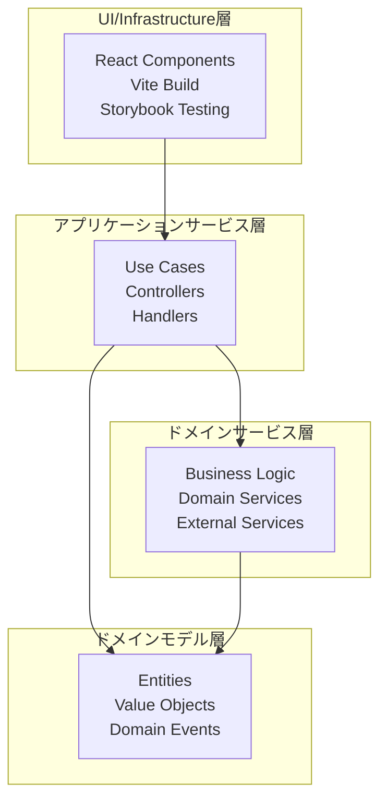

# コントリビューションガイド

## 開発環境セットアップ

### セットアップ手順

```bash
# リポジトリをクローン
git clone https://github.com/your-username/chatgptree.git
cd chatgptree

# 依存関係をインストール
pnpm install

# 開発サーバーを起動
pnpm dev
```

### 推奨開発環境

- **VS Code**: 推奨エディタ
- **拡張機能**: `.vscode/extensions.json`を参照

## プロジェクト構造

```text
chatgptree/
├── src/
│   ├── components/         # Reactコンポーネント
│   ├── layouts/            # レイアウトコンポーネント
│   ├── hooks/              # カスタムフック
│   ├── lib/                # ユーティリティ・ライブラリ
│   ├── domain-models/      # ドメインモデル（エンティティ、値オブジェクト）
│   ├── domain-services/    # ドメインサービス
│   ├── app-services/       # アプリケーションサービス
│   ├── App.tsx             # メインアプリケーション
│   └── main.tsx            # エントリーポイント
├── tests/                  # テストファイル
│   ├── logics/             # Node.js上で動作するテスト(*.test.ts)
│   ├── stories/            # Storybook上で動作するテスト(*.stories.ts)
│   └── components/         # コンポーネントテスト
├── .storybook/             # Storybook設定
├── docs/                   # ドキュメント
│   └── stories/            # Storybookドキュメント
├── public/                 # 静的ファイル
└── dist/                   # ビルド出力
```

## アーキテクチャ

### オニオンアーキテクチャ

プロジェクトはクリーンアーキテクチャの原則に従い、以下の4層で構成されています:



**依存方向**: 外側の層から内側の層への依存のみ許可。内側の層は外側の層に依存しません。

## テスト

### テストファイル配置規則

- **Node.jsで動作するテスト**: `tests/logics/*.test.ts`
  - ドメインサービスのテスト
  - ビジネスロジック、ユーティリティ関数のテスト
- **Storybook interaction tests**: `tests/stories/*.stories.tsx`
  - UIコンポーネントのテスト
  - ユーザーインタラクション、レンダリングのテスト

### テストケース命名規則

**命名例**:

- 「Windowコンポーネントをクリックすると最前面に移動する」 → `WindowMovesToFrontWhenClicked`
- 「関数Aは空の配列が渡された場合、空の結果を返す」 → `FunctionAReturnsEmptyResultForEmptyArray`

### テスト構造（AAAパターン）

```typescript
// {テスト内容を日本語で記載する}
// Arrange
// テストに必要なデータ、モック、セットアップを準備

// Action
// テスト対象の処理を実行

// Assert
// 期待される結果を検証
```

## コーディング規約

### 命名規則

- **変数・関数**: camelCase
- **コンポーネント・クラス**: PascalCase
- **定数**: UPPER_SNAKE_CASE
- **ディレクトリ**: kebab-case

## Git運用ルール

- **実装対象issueのidを使用**: `issues/27` (#27の実装の場合)
- **コミットプレフィックス**
  - `feat:` - 新機能
  - `fix:` - バグ修正
  - `docs:` - ドキュメントのみの変更
  - `style:` - コードの意味に影響しない変更（空白、フォーマット等）
  - `refactor:` - バグ修正や機能追加ではないコードの変更
  - `test:` - テストの追加や修正
  - `chore:` - ビルドプロセスや補助ツールの変更

## CI/CD

### GitHub Actions

プロジェクトでは以下のGitHub Actionsワークフローが設定されています：

#### master-pr.yaml (PR to master時)

**トリガー**: masterブランチへのプルリクエスト時

**ジョブ**:

- **test**: Node.js環境での単体テスト実行（Vitest）
- **storybook-test**: Storybook環境でのコンポーネントテスト実行
- **build**: プロダクションビルドの確認

#### release-push.yaml (releaseブランチプッシュ時)

**トリガー**: releaseブランチへのプッシュ時

**ジョブ**:

- **build-and-publish**: プロダクションビルドとGitHub Pagesへの自動デプロイ

### ローカルでの事前チェック

```bash
# リンター実行
pnpm lint

# テスト実行
pnpm test

# Storybookテスト実行
pnpm test:storybook

# ビルド確認
pnpm build
```

## ライセンス

このプロジェクトへの貢献により、あなたのコードはMITライセンスの下で公開されることに同意したものとみなされます。
