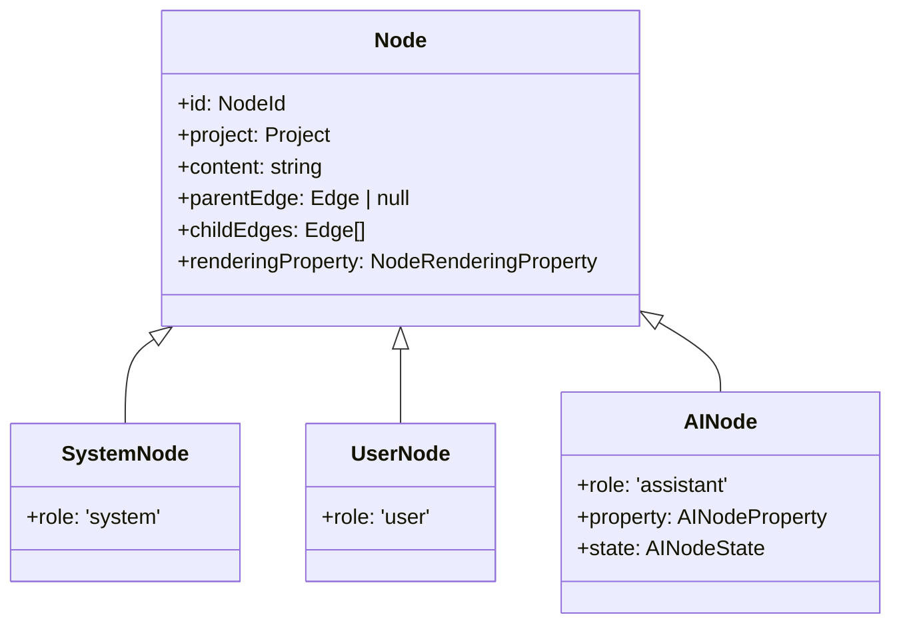
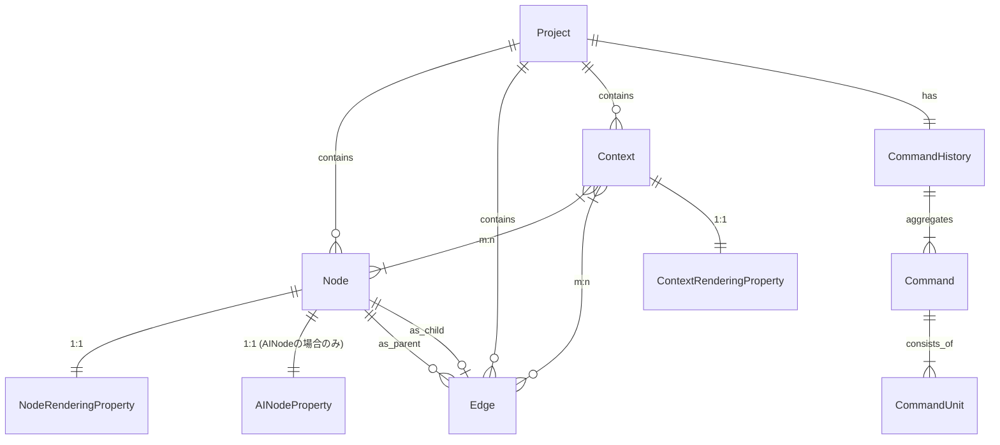

# ドメインモデル表

## クラス図（継承関係）

## ER図（関連関係）

## ドメインモデル一覧

### Entity

#### Project

| name            | type             | description                                   |
|-----------------|------------------|-----------------------------------------------|
| id              | ProjectId        | プロジェクトの識別子                          |
| name            | string           | プロジェクト名                                |
| nodes           | Node[]           | プロジェクト内のノード群                      |
| edges           | Edge[]           | プロジェクト内のエッジ群                      |
| contexts        | Context[]        | プロジェクト内のコンテキスト群                |
| commandHistory  | CommandHistory   | プロジェクトに対応する単一のコマンド履歴集約  |

---

#### Node

| name            | type                 | description                                      |
|-----------------|----------------------|--------------------------------------------------|
| id              | NodeId               | ノードの識別子                                   |
| project         | Project              | 所属するプロジェクト                             |
| role            | NodeRole             | ノードの役割 (system / user / assistant)         |
| content         | string               | ノード本文                                       |
| parentEdge      | Edge \| null         | 親エッジ。ルートの場合は null                    |
| childEdges      | Edge[]               | 子エッジ群                                       |
| renderingProperty | NodeRenderingProperty | ノード描画用プロパティ (アプリ層で継承して使用) |

#### SystemNode extends Node

| name | type | description |
|------|------|-------------|
| role | 'system' | システムノード |

#### UserNode extends Node

| name | type | description |
|------|------|-------------|
| role | 'user' | ユーザノード |

#### AINode extends Node

| name    | type           | description               |
|---------|----------------|---------------------------|
| role | 'assistant' | AI ノード |
| property | AINodeProperty | AI ノードのパラメータ     |
| state   | AINodeState    | AI ノードの状態           |

---

#### Edge

| name    | type     | description                              |
|---------|----------|------------------------------------------|
| id      | EdgeId   | エッジの識別子                           |
| project | Project  | 所属するプロジェクト                     |
| contexts | Context[] | エッジが属するコンテキスト群 |
| source  | Node     | エッジの始点ノード（親側）               |
| target  | Node     | エッジの終点ノード（子側）               |

---

#### Context

| name             | type                    | description                                |
|------------------|-------------------------|--------------------------------------------|
| id               | ContextId               | コンテキストの識別子                       |
| project          | Project                 | 所属するプロジェクト                       |
| nodes            | Node[]                  | コンテキストに属するノード群                 |
| edges            | Edge[]                  | 根から対象ノードまでのパス順エッジ群         |
| name             | string \| null          | 任意のコンテキスト名 (非ユニーク)           |
| renderingProperty| ContextRenderingProperty| コンテキスト描画用プロパティ (詳細は空)    |

---

#### CommandHistory

| name   | type       | description                                      |
|--------|------------|--------------------------------------------------|
| id     | string     | コマンド履歴識別子                               |
| project | Project    | 対応するプロジェクト                             |
| past   | Command[]  | Undo 用に保持する過去コマンド群                  |
| future | Command[]  | Redo 用に保持する未来コマンド群                  |
| limit  | number     | 保持上限（目安 20 操作）                         |

---

### ValueObject

#### 基本ID

| name      | type   | description                  |
|-----------|--------|------------------------------|
| ProjectId | string | プロジェクト識別子           |
| NodeId    | string | ノード識別子                 |
| EdgeId    | string | エッジ識別子                 |
| ContextId | string | コンテキスト識別子           |

---

#### NodeRole

| type | description |
|------|-------------|
| 'system' | システムノード |
| 'user' | ユーザノード |
| 'assistant' | AIノード |

---

#### AINodeState

| type | description |
|------|-------------|
| 'normal' | 通常状態 |
| 'waiting' | 計算待ち状態 |
| 'running' | 計算中状態 |
| 'error' | エラー状態 |

---

#### AINodeProperty

| name       | type   | description        |
|------------|--------|--------------------|
| model      | string | 使用するモデル名   |
| temperature| number | サンプリング温度   |
| topP       | number | サンプリングの確率上限 |

---

### DomainEvent

#### Command

| name      | type          | description                          |
|-----------|---------------|--------------------------------------|
| id        | string        | コマンド識別子                       |
| units     | CommandUnit[] | コマンドを構成するユニットの集合      |
| timestamp | Date          | コマンド発生日時                     |

---

#### CommandUnit

| name      | type   | description                                                     |
|-----------|--------|-----------------------------------------------------------------|
| id        | string | コマンドユニット識別子                                          |
| type      | 'nodeCreated' \| 'nodeDeleted' \| 'edgeCreated' \| ...   | 種別 |

#### NodeCreated extends CommandUnit

| name            | type  | description                        |
|-----------------|-------|------------------------------------|
| type            | 'nodeCreated' | 種別 |
| node            | Node  | 作成されたノード                   |

#### NodeDeleted extends CommandUnit

| name                | type   | description                                 |
|---------------------|--------|---------------------------------------------|
| type                | 'nodeDeleted' | 種別 |
| node                | Node   | 削除されたノード                            |

#### EdgeCreated extends CommandUnit

| name   | type | description            |
|--------|------|------------------------|
| type   | 'edgeCreated' | 種別 |
| edge   | Edge | 作成されたエッジ        |

#### EdgeDeleted extends CommandUnit

| name   | type | description            |
|--------|------|------------------------|
| type   | 'edgeDeleted' | 種別 |
| edge   | Edge | 削除されたエッジ        |

#### NodeRenderingPropertyUpdated extends CommandUnit

| name   | type                 | description               |
|--------|----------------------|---------------------------|
| type   | 'nodeRenderingPropertyUpdated' | 種別 |
| node   | Node                 | 対象ノード                |
| before | NodeRenderingProperty| 更新前の描画プロパティ    |
| after  | NodeRenderingProperty| 更新後の描画プロパティ    |

#### NodeContentUpdated extends CommandUnit

| name   | type   | description         |
|--------|--------|---------------------|
| type   | 'nodeContentUpdated' | 種別 |
| node   | Node   | 対象ノード          |
| before | string | 更新前の内容        |
| after  | string | 更新後の内容        |

#### AINodePropertyUpdated extends CommandUnit

| name   | type           | description          |
|--------|----------------|----------------------|
| type   | 'aiNodePropertyUpdated' | 種別 |
| node   | AINode         | 対象ノード           |
| before | AINodeProperty | 更新前のプロパティ   |
| after  | AINodeProperty | 更新後のプロパティ   |

#### AINodeCalculationRequested extends CommandUnit

| name | type  | description   |
|------|-------|---------------|
| type   | 'aiNodeCalculationRequested' | 種別 |
| node | AINode| 通常状態から計算待ち状態に遷移したノード|

#### AINodeCalculationStarted extends CommandUnit

| name | type  | description   |
|------|-------|---------------|
| type   | 'aiNodeCalculationStarted' | 種別 |
| node | AINode| 計算待ち状態から計算中状態に遷移したノード|

#### AINodeCalculationCompleted extends CommandUnit

| name | type  | description   |
|------|-------|---------------|
| type   | 'aiNodeCalculationCompleted' | 種別 |
| node | AINode| 計算中状態から通常状態に遷移したノード|

#### AINodeCalculationErrored extends CommandUnit

| name  | type  | description           |
|-------|-------|-----------------------|
| type   | 'aiNodeCalculationErrored' | 種別 |
| node  | AINode| エラーとなったノード  |
| error | string| エラーメッセージ       |

#### AINodeCalculationRetried extends CommandUnit

| name | type  | description   |
|------|-------|---------------|
| type   | 'aiNodeCalculationRetried' | 種別 |
| node | AINode| リトライ対象(エラー状態から計算待ち状態に遷移したノード)   |

#### ContextCreated extends CommandUnit

| name   | type    | description        |
|--------|---------|--------------------|
| type   | 'contextCreated' | 種別 |
| context| Context | 作成されたコンテキスト|
| project | Project | コンテキストが属するプロジェクト|

#### ContextDeleted extends CommandUnit

| name   | type    | description        |
|--------|---------|--------------------|
| type   | 'contextDeleted' | 種別 |
| context| Context | 削除されたコンテキスト|
| project | Project | コンテキストが属するプロジェクト|

#### ContextNodeAdded extends CommandUnit

| name   | type    | description        |
|--------|---------|--------------------|
| type   | 'contextNodeAdded' | 種別 |
| context| Context | ノードが追加されたコンテキスト|
| node   | Node | 追加されたノード|

#### ContextNodeRemoved extends CommandUnit

| name   | type    | description        |
|--------|---------|--------------------|
| type   | 'contextNodeRemoved' | 種別 |
| context| Context | ノードが削除されたコンテキスト|
| node   | Node | 削除されたノード|

#### ContextEdgeAppended extends CommandUnit

| name   | type    | description        |
|--------|---------|--------------------|
| type   | 'contextEdgeAppended' | 種別 |
| context| Context | エッジが追加されたコンテキスト|
| edge   | Edge | 追加されたエッジ|
| node   | Node | 追加されたノード|

#### ContextEdgePopped extends CommandUnit

| name   | type    | description        |
|--------|---------|--------------------|
| type   | 'contextEdgePopped' | 種別 |
| context| Context | エッジが削除されたコンテキスト|
| edge   | Edge | 削除されたエッジ|

#### ContextRenderingPropertyUpdated extends CommandUnit

| name   | type                     | description                 |
|--------|--------------------------|-----------------------------|
| type   | 'contextRenderingPropertyUpdated' | 種別 |
| context| Context                  | 対象コンテキスト            |
| before | ContextRenderingProperty | 更新前の描画プロパティ      |
| after  | ContextRenderingProperty | 更新後の描画プロパティ      |
