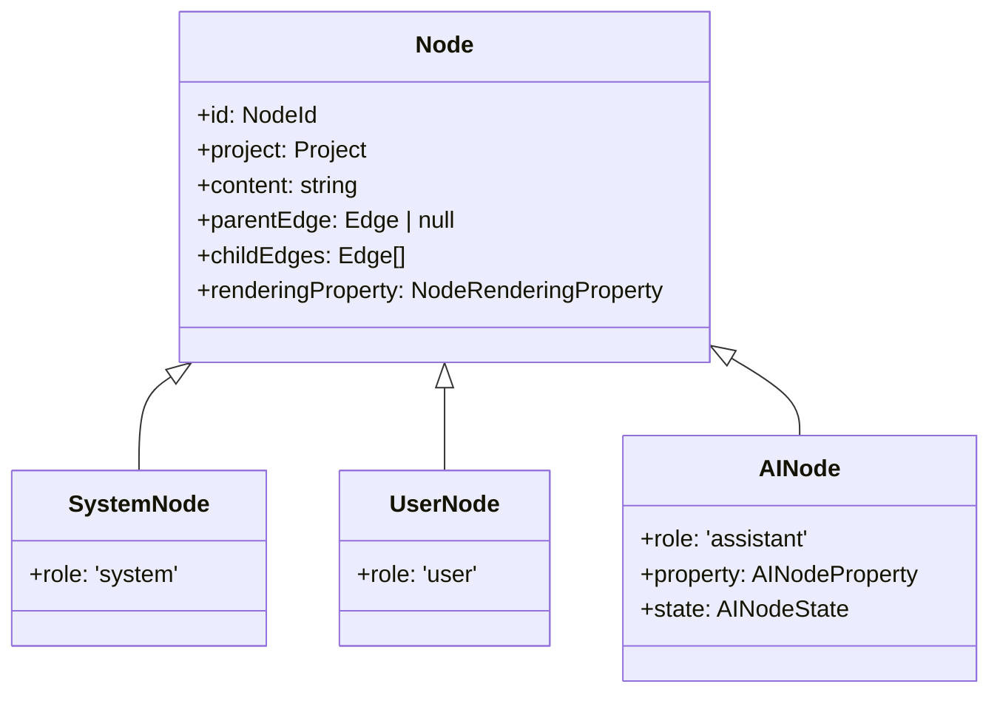
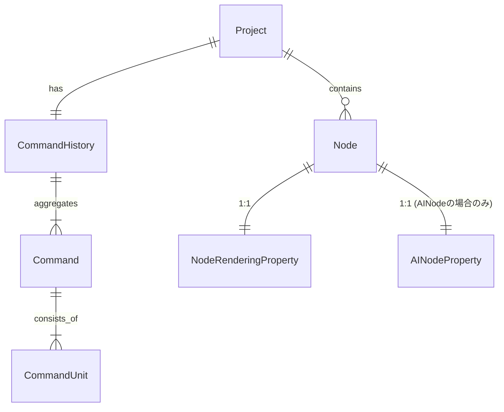

# ドメインモデル表

## クラス図（継承関係）

## ER図（関連関係）

## ドメインモデル一覧

### Entity

#### Project

| name            | type             | description                                   |
|-----------------|------------------|-----------------------------------------------|
| id              | ProjectId        | プロジェクトの識別子                          |
| name            | string           | プロジェクト名                                |
| nodes           | Node[]           | プロジェクト内のノード群                      |
| commandHistory  | CommandHistory   | プロジェクトに対応する単一のコマンド履歴集約  |

---

#### Node

| name            | type                 | description                                      |
|-----------------|----------------------|--------------------------------------------------|
| id              | NodeId               | ノードの識別子                                   |
| project         | Project              | 所属するプロジェクト                             |
| role            | NodeRole             | ノードの役割 (system / user / assistant)         |
| content         | string               | ノード本文                                       |
| parentNodeId    | NodeId \| null       | 親ノードの識別子。ルートの場合は null            |
| childNodeIds    | NodeId[]             | 子ノードの識別子群                               |
| renderingProperty | NodeRenderingProperty | ノード描画用プロパティ (アプリ層で継承して使用) |

#### SystemNode extends Node

| name | type | description |
|------|------|-------------|
| role | 'system' | システムノード |

#### UserNode extends Node

| name | type | description |
|------|------|-------------|
| role | 'user' | ユーザノード |

#### AINode extends Node

| name    | type           | description               |
|---------|----------------|---------------------------|
| role | 'assistant' | AI ノード |
| property | AINodeProperty | AI ノードのパラメータ     |
| state   | AINodeState    | AI ノードの状態           |

---

#### CommandHistory

| name   | type       | description                                      |
|--------|------------|--------------------------------------------------|
| id     | string     | コマンド履歴識別子                               |
| project | Project    | 対応するプロジェクト                             |
| past   | Command[]  | Undo 用に保持する過去コマンド群                  |
| future | Command[]  | Redo 用に保持する未来コマンド群                  |
| limit  | number     | 保持上限（目安 20 操作）                         |

---

### ValueObject

#### 基本ID

| name      | type   | description                  |
|-----------|--------|------------------------------|
| ProjectId | string | プロジェクト識別子           |
| NodeId    | string | ノード識別子                 |

---

#### NodeRole

| type | description |
|------|-------------|
| 'system' | システムノード |
| 'user' | ユーザノード |
| 'assistant' | AIノード |

---

#### NodeRenderingProperty

| name | type | description |
|------|------|-------------|
| left | number | ノードの左端位置 |
| top | number | ノードの上端位置 |
| width | number | ノードの幅 |
| height | number | ノードの高さ |

---

#### AINodeState

| type | description |
|------|-------------|
| 'normal' | 通常状態 |
| 'waiting' | 計算待ち状態 |
| 'running' | 計算中状態 |
| 'error' | エラー状態 |

---

#### AINodeProperty

| name       | type   | description        |
|------------|--------|--------------------|
| model      | string | 使用するモデル名   |
| temperature| number | サンプリング温度   |
| topP       | number | サンプリングの確率上限 |

---

#### Command

| name      | type          | description                          |
|-----------|---------------|--------------------------------------|
| units     | CommandUnit[] | コマンドを構成するユニットの集合      |
| timestamp | Date          | コマンド発生日時                     |

---

#### CommandUnit

| name      | type   | description                                                     |
|-----------|--------|-----------------------------------------------------------------|
| type      | 'createSystemNode' \| 'createUserNode' \|  ...   | 種別 |

以下のValueObjectはCommandUnitを継承する。

- CreateSystemNode
- CreateUserNode
- CreateAINode
- DeleteSystemNode
- DeleteUserNode
- DeleteAINode
- UpdateNodeContent
- UpdateNodeRenderingProperty
- UpdateParentNode
- AppendChildNode
- RemoveChildNode
- UpdateAINodeProperty
- RequestAINodeCalculation
- StartAINodeCalculation
- CompleteAINodeCalculation
- ErrorAINodeCalculation
- RetryAINodeCalculation

---

### DomainEvent

#### NodeAdded

ノードがプロジェクトに追加されたことを示すイベント。

| name      | type           | description                  |
|-----------|----------------|------------------------------|
| type      | 'node-added'   | イベントの種別               |
| nodeId    | NodeId         | 追加されたノードの識別子     |

#### NodeUpdated

プロジェクト内のノードが更新されたことを示すイベント。

| name      | type             | description                  |
|-----------|------------------|------------------------------|
| type      | 'node-updated'   | イベントの種別               |
| nodeId    | NodeId           | 更新されたノードの識別子     |

#### NodeDeleted

ノードがプロジェクトから削除されたことを示すイベント。

| name      | type             | description                  |
|-----------|------------------|------------------------------|
| type      | 'node-deleted'   | イベントの種別               |
| nodeId    | NodeId           | 削除されたノードの識別子     |
